# I. ¿Qué es un ODD?

En este último tema, veremos en qué consiste un documento ODD (One Document Does it All) y cuál es su función al interno de un proyecto de codificación TEI.

Como hemos visto a lo largo de los temas anteriores, el sistema de codificación TEI consiste en una lista de módulos que contienen una serie de elementos con sus especificaciones. A su vez, cada uno de los elementos TEI tiene un nombre “estándar” o canónico (como pueden ser p, div, corr, sic, etc.), una descripción de su función, la indicación del modelo o clase al que pertenece, una definición de los atributos que puede contener, así como una lista de ejemplos; esta es la estructura que, de hecho, vemos cada vez que consultamos un elemento en las Guías directrices.

A parte de estas especificaciones generales, hemos visto como el esquema TEI puede ser de diferentes tipos (DTD, esquema W3C, RelaxNG), personalizándolo según nuestras necesidades. El más utilizado y del que nos hemos ocupado en el tema anterior ha sido el esquema RelaxNG. Estos esquemas tienen como función recoger todas las referencias a los módulos, elementos, etc. que establece el modelo general de TEI; además, tenemos la posibilidad de personalizar estos esquemas, modificando módulos, elementos, atributos o clases, etc.

En todo este engranado, hay una última etapa que es de vital importancia, y esto es, el documento ODD que es el que conservará todas y cada una de las modificaciones y de las singularidades o especificaciones de nuestro esquema.

El documento ODD responde a las siglas One Document Does it All y consiste en un fichero XML-TEI. A partir de este fichero podremos generar el esquema en diferentes lenguajes y recuperar la documentación de nuestro proyecto.

Veamos cuales son las prestaciones que nos ofrece el documento ODD:

* El documento ODD es el único que nos permitirá recuperar nuestro esquema personalizado. Es muy importante tener en cuenta que un esquema (RelaxNG o otros tipos) NO puede subirse a la aplicación ROMA, y por tanto si lo hemos modificado no habrá manera de recuperar las informaciones que hayamos añadido. Por ejemplo, imaginemos que hemos definido una nueva semántica para algunos de los elementos TEI, eliminado elementos y definido valores por defecto en los atributos. Pues bien, todas estas informaciones solo serán recuperables si, al finalizar la personalización, creamos el documento ODD. En la aplicación ROMA solo pueden subirse los documentos ODD, no aceptará ni esquemas ni ficheros XML-TEI codificados.
* En cualquier proyecto de edición, especialmente en las primeras etapas, es normal modificar el esquema de codificación, de manera que cada vez que lo modifiquemos deberemos crear también un documento ODD que será el responsable de generarnos el esquema deseado.
* El documento ODD también nos permitirá generar, además de los esquemas, una nueva documentación tal y como la habremos redactado para nuestro proyecto.
* En fin, el documento ODD es la pieza clave para poder difundir y compartir nuestro esquema de codificación. No solo con la comunidad TEI, sino también entre los mismos miembros de un equipo.

# II. Creación del ODD

Pasemos ahora a ver cómo podemos crear y manipular un documento ODD con la aplicación Roma. Obviamente podríamos crearlo a mano, si conocemos bien la sintaxis a utilizar, tal y como ocurría con los esquemas, pero la práctica habitual es el uso de Roma que ya habéis tenido ocasión de utilizar.

Para que toméis una primera toma de contacto con un fichero ODD os recomiendo que creéis uno con vuestro programa oXygen, siguiendo estos pasos:

File > New > Framework templates > TEI ODD > ODD [TEI ODD] > Create
 
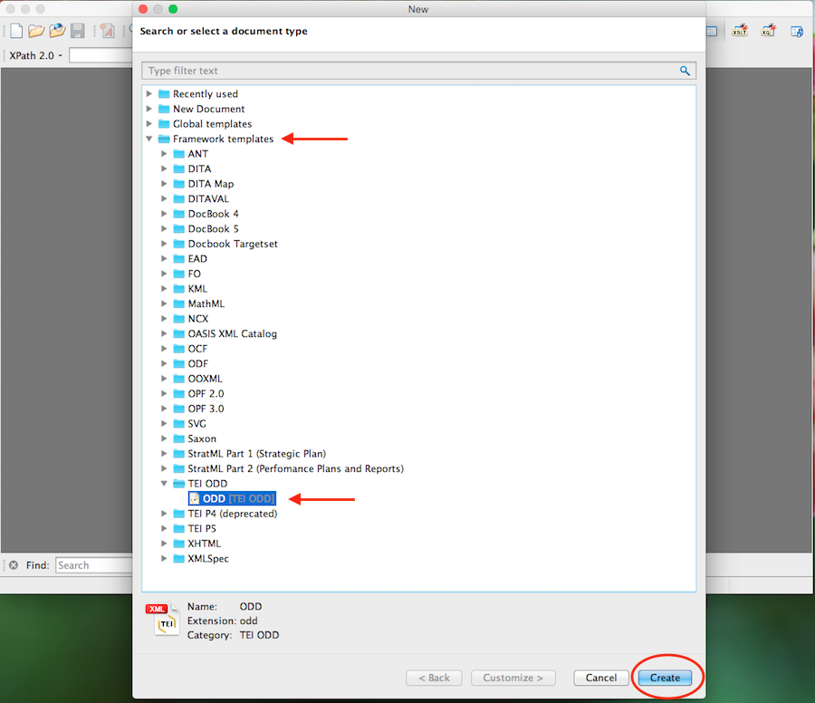

Como podéis observar, se trata de un fichero XML-TEI normal con el prólogo XML, un elemento raíz `<TEI>`, al interior del cual tenemos un `<teiheader>` con los diferentes metadatos, y un elemento `<text>` que contiene a su vez el `<body>`. Ahora bien, los elementos que aparecen a continuación son nuevos:

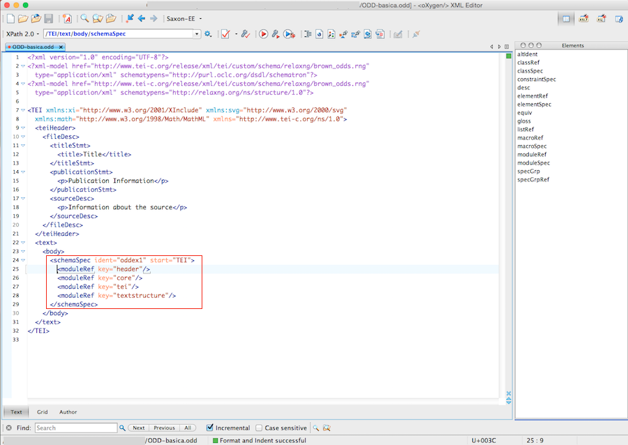
 
El elemento `<schemaSpec>` responde a Schema Specification, es decir, señala el tipo de esquema que debe reconstruir, indicando además el elemento raíz a través del atributo `@start`.

A continuación lista los diferentes módulos que el esquema resultante deberá contener. Como podéis ver, se trata sólo de los módulos obligatorios: header, core, tei y textstructure.

De hecho, este sería el mismo resultado que si, en la aplicación Roma, creáramos un esquema mínimo. Hagamos la prueba:

1. Id a la aplicación Roma y cread un esquema a partir del modelo mínimo:

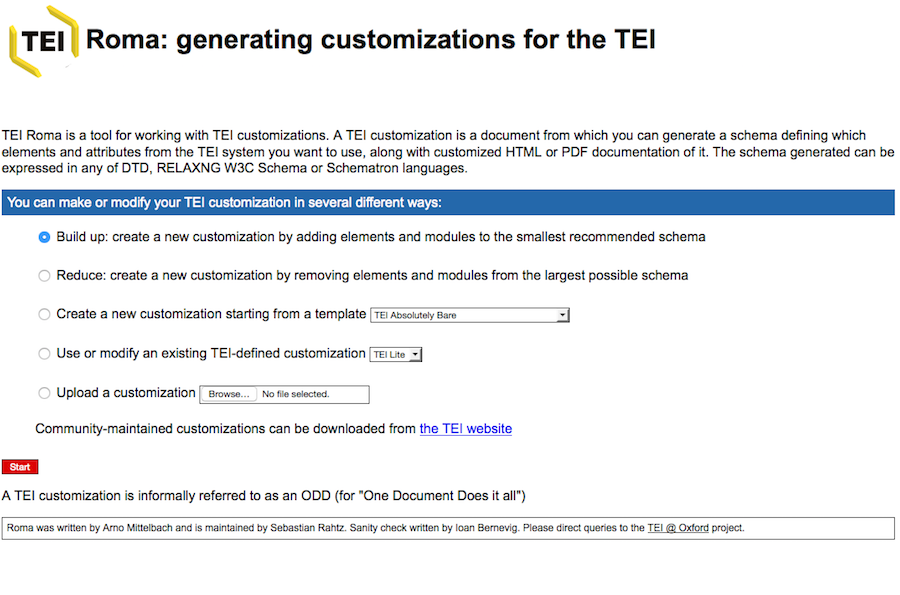

2. Cambiad los metadatos esenciales en la pestaña “Personalizar”:

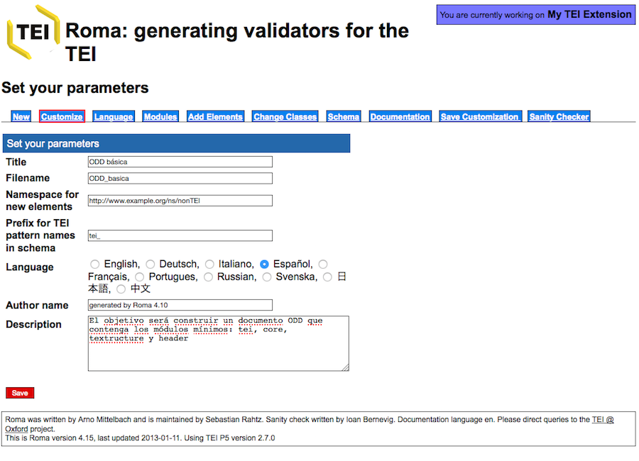
 
3) Si ahora quisiéramos generar un esquema RelaxNG, iríamos a la pestaña “Esquema”, si quisiéramos obtener la documentación relativa a ese esquema, seleccionaríamos la pestaña “Documentación”. Ahora lo que nos interesa es crear el documento ODD, por lo que iremos a “Guardar configuración personal”:

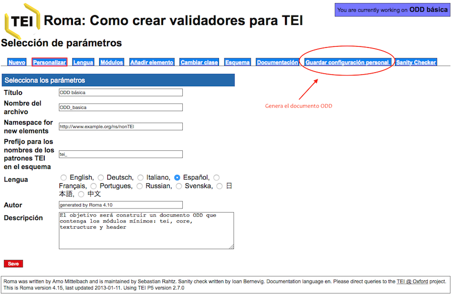
 
Al pulsar, se descargará de manera automática el fichero ODD, que si abrimos con el programa oXygen, veremos que contiene la misma estructura y los mismos módulos obligatorios; además de la descripción que añadimos en la pestaña “Personalizar” se reflejan en el documento obtenido:

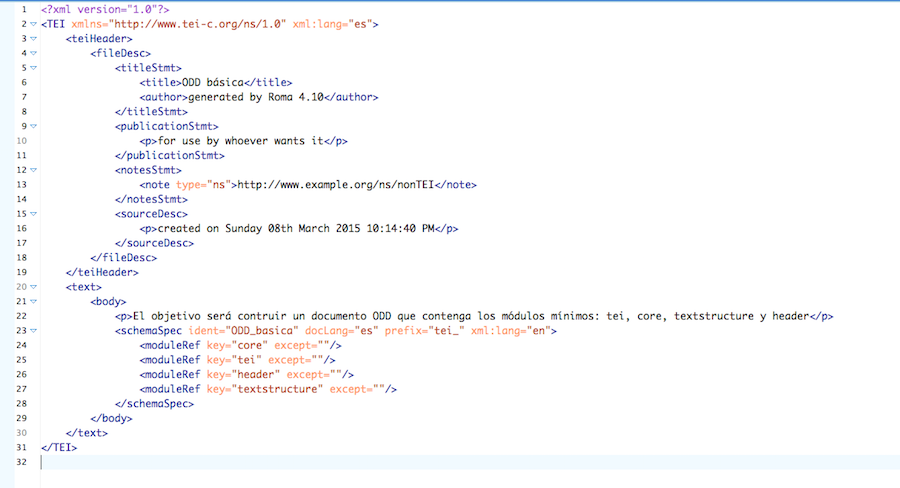
 
Aparecen los siguientes elementos y atributos:

* `schemaSpec` es la definición formal del esquema TEI.
* `@ident`: contiene el identificador que corresponde al nombre del fichero que le hemos consignado.
* `@docLang`: indica la lengua de la documentación, en nuestro caso el español es.
* `@prefix`: `tei_` es el prefijo que se utilizará para todas las definiciones de los casos TEI.
* `@key`: es el responsable de llamar a los identificadores de los módulos y todo el contenido que hay en ellos.

En resumen, una personalización mínima de TEI, registrada en un documento ODD, contendrá siempre los módulos obligatorios. De ser de otra manera, ya no sería un fichero TEI, sino otra cosa; y cada uno de esos módulos, incluye a su vez una lista de elementos y atributos predefinidos.

Hagamos otra prueba, retomando nuestro fichero ODD que hemos creado y siguiendo estos pasos:

1. En la página principal de Roma, escoged la opción “Upload Customization” y elegid vuestro fichero creado con Roma:


2. Como podéis ver, hemos recuperado las informaciones que habíamos introducido:

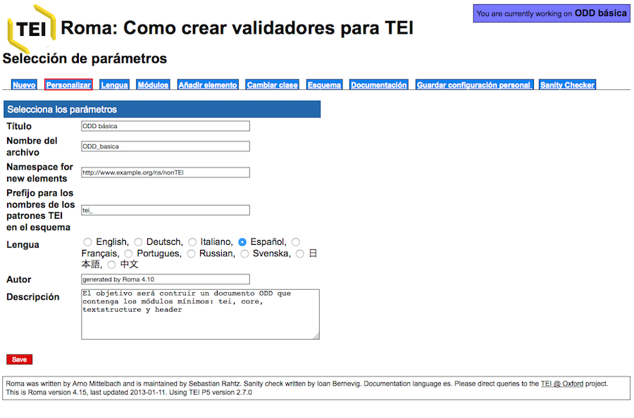

3. Ahora vayamos a la pestaña de “Módulos” y añadamos el módulo verse:

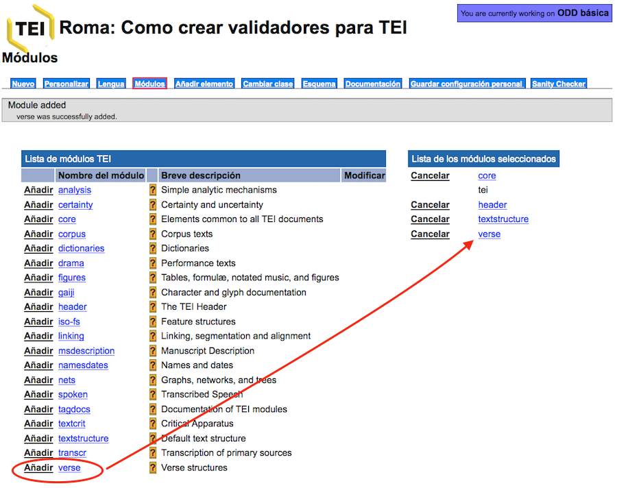
 
4. Hagamos click en el módulo verse, eliminemos los elementos <metDecl> y <metSym> y guardemos los cambios:

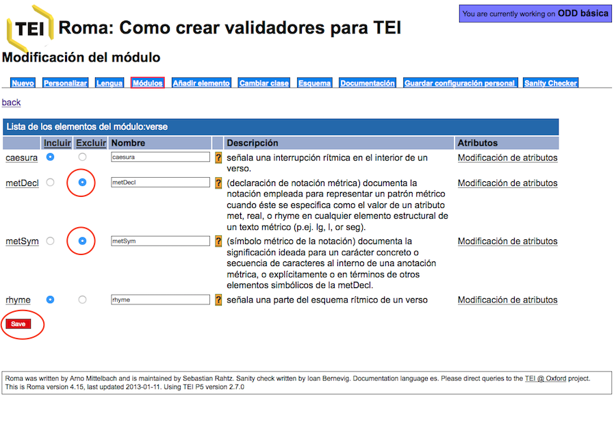
 
5. Al interno del elemento `<caesura>` haremos un solo cambio: ampliaremos la “Descripción”:


6. Al interno del elemento `<rhyme>`, modificaremos los valores de los atributos en la pestaña correspondiente “Modificación de atributos” y señalando los valores en la casilla “Lista de valores”. En nuestro caso señalando el tipo de rima en “consonante” o “asonante”, separados por comas y sin espacios:

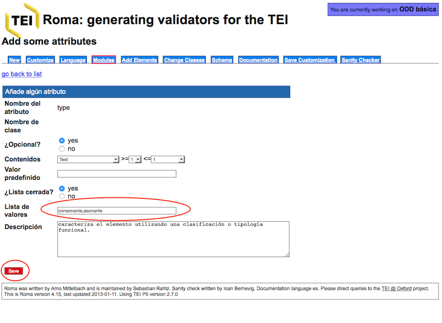
 
7. Si quisiéramos generar el esquema correspondiente iríamos a la pestaña “Esquema” y seleccionaríamos el tipo de esquema deseado:

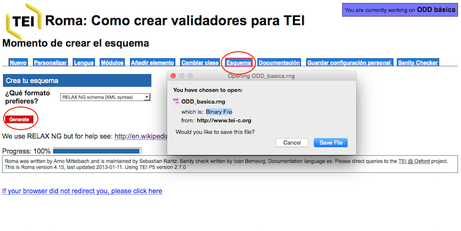
 
Esta modificación nos simplificaría la tarea al codificar, preestableciendo nuestros valores:
 
8. Generemos finalmente el documento ODD, clicando en “Guardar configuración personal” y abramos el documento con oXygen:

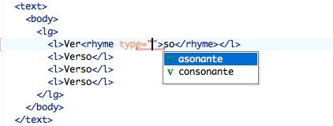
 
Como vemos, el resultado es la suma de los cambios realizados en nuestro esquema:

* Se ha añadido el módulo verse, señalando los dos elementos que hemos eliminado.
* Se recoge la nueva descripción del elemento `<caesura>`.
* Así como se añaden los valores al atributo @type a través de una lista de valores (`<valList>`) y los valores individuales (`<valItem>`).

A partir de ahora, cada vez que subamos este documento ODD a la aplicación Roma recuperaremos el mismo esquema, conservando siempre las modificaciones que hemos llevado a cabo. ¡Imaginaros cuanto tiempo nos llevaría modificar nuestro esquema, si tuviéramos que incorporar toda la personalización cada vez que quisiéramos realizar algún cambio!

Resumiendo, lo que siempre debemos tener para trabajar en cualquier proyecto de edición digital es el documento XML-TEI, el esquema RNG, y la ODD. 

Y una última cuestión importante, el esquema RNG debe siempre ir asociado correctamente con el documento XML-TEI. Así, por ejemplo, si tuviéramos estos dos documentos en una única carpeta, el prólogo del documento XML-TEI sería simplemente: 

```xml
<?xml version="1.0" encoding="UTF-8"?>
<?xml-model href="Mi_esquema.rng" type="application/xml" schematypens="http://relaxng.org/ns/structure/1.0"?>
<TEI xmlns="http://www.tei-c.org/ns/1.0">
…
</TEI>
```

# III. Bibliografía

* Getting Started with P5 ODD, <http://www.tei-c.org/guidelines/customization/getting-started-with-p5-odds/> 
* TEI ODD Wiki, <https://wiki.tei-c.org/index.php/ODD> 
* Understanding ODD, digital.humanities@oxford (University of Oxford), <http://tei.oucs.ox.ac.uk/Talks/2011-06-18-odd/> 

